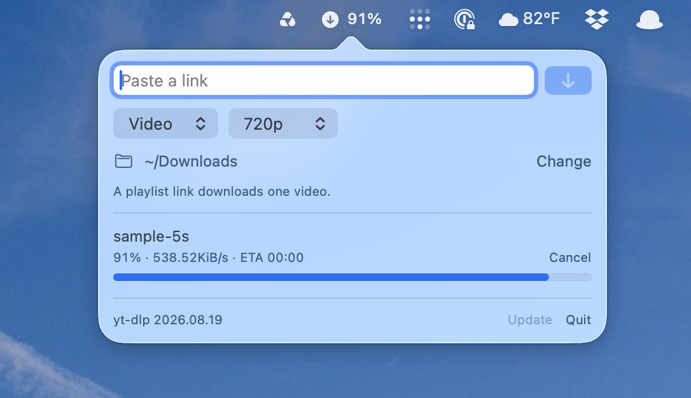

# YTDLP Bar



A menu bar app for macOS that downloads one link at a time with [yt-dlp](https://github.com/yt-dlp/yt-dlp). Paste a link, pick video or audio, and the panel shows the title, percent, speed, and time left. The menu bar shows the percent while something is running.

The idea comes from Alex Zeitler's [omarchy-yt-dlp-plugin](https://github.com/AlexZeitler/omarchy-yt-dlp-plugin).

## How a download works

Open the menu bar icon. If the link field is empty and the clipboard holds a link, that link is filled in. The same link is not pasted again after you just started it, so the field stays clear.

Choose Video or Audio. Video can be Best, 1080p, 720p, or 480p. Audio can stay in the format yt-dlp already has (Keep, which does not re-encode) or be converted to mp3, m4a, opus, flac, or wav. Those choices, and the download folder, are remembered. The folder starts as ~/Downloads. Click the folder to open it, or Change to pick another one.

Press the download button or Return. The link clears, and the job waits if something else is already running. Only one download runs at a time. A playlist link downloads a single video.

While it runs, the row shows the title, percent, speed, and time remaining, and the menu bar shows the percent. Cancel stops the one that is running. Remove drops one that is still waiting. Click a finished row to show that file in Finder. Clear hides finished rows.

Files are saved as `Title [id].ext` in the folder you picked.

Quit stops the download that is running. The queue is saved, and the next time you open the app that download starts again from the beginning.

Update checks Homebrew for a newer yt-dlp. If yt-dlp or ffmpeg is missing, the panel offers to install them with Homebrew.

## Build it

You need macOS 14 or later, and [yt-dlp](https://github.com/yt-dlp/yt-dlp) and ffmpeg on your PATH. Homebrew is the path the app looks for first (`/opt/homebrew/bin`).

```sh
git clone https://github.com/lowellheddings/ytdlp-bar.git
cd ytdlp-bar
scripts/build-app.sh
open "dist/YTDLP Bar.app"
```

The script builds a release binary and packages `dist/YTDLP Bar.app`. To start it at login, add that app in System Settings → General → Login Items & Extensions.

```sh
swift test
```
